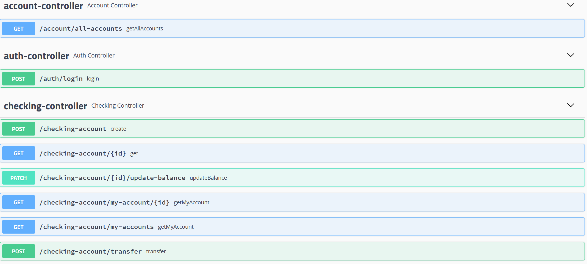
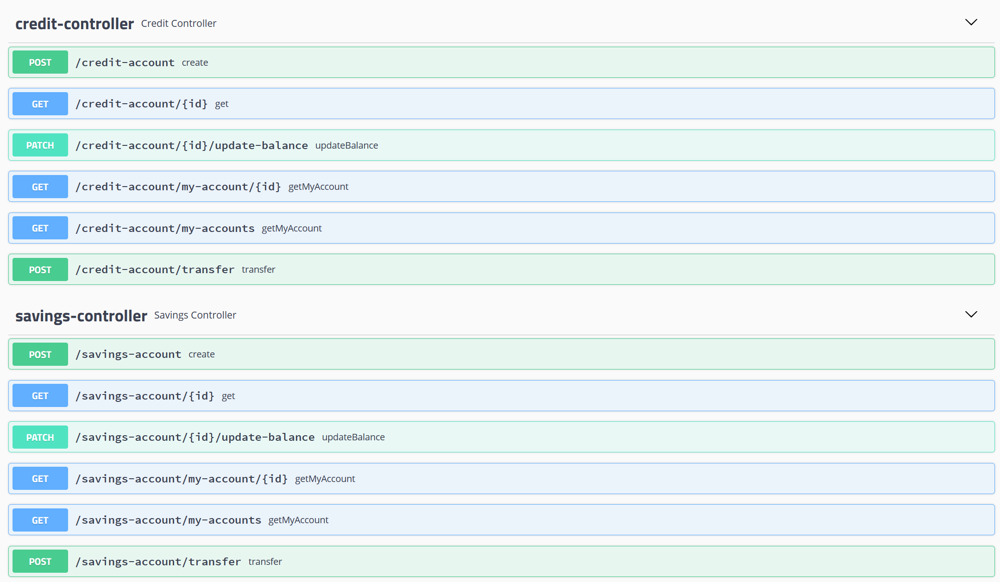
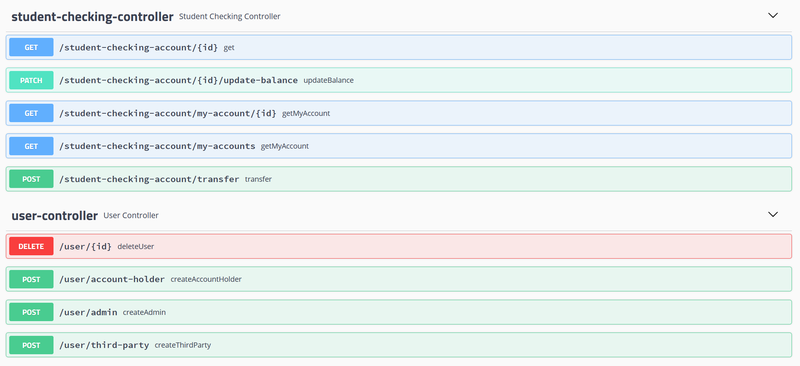
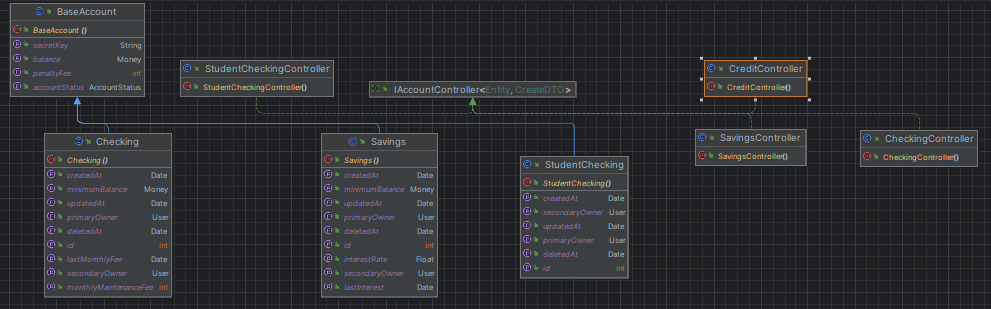

## IRONBANK - JOEL CAMPOS
#### FInal Ironhack project

### API DOCUMENTATION
In order to visualize the API documentation, go to: http://localhost:8042/swagger-ui.html, there you will find all the endpoints available. You will also be able to test them using the docs page.

#### ENDPOINTS

### MICROSERVICES
This project uses Keycloak as the authentication server. It is connected as a microservice.

### LIBRARIES
This project uses some libraries in order to offer some functionalities:
- Unirest: testing.
- Springfox Swagger: interactive API documentation.
- Keycloak: keycloak admin SDK.

### DATABASE
The project uses a MySQL database. All tables have three timestamps (createdAt, updatedAt and deletedAt). Records are never deleted, they just update the deletedAt value to be the current timestamp.

### CLASS DIAGRAM
